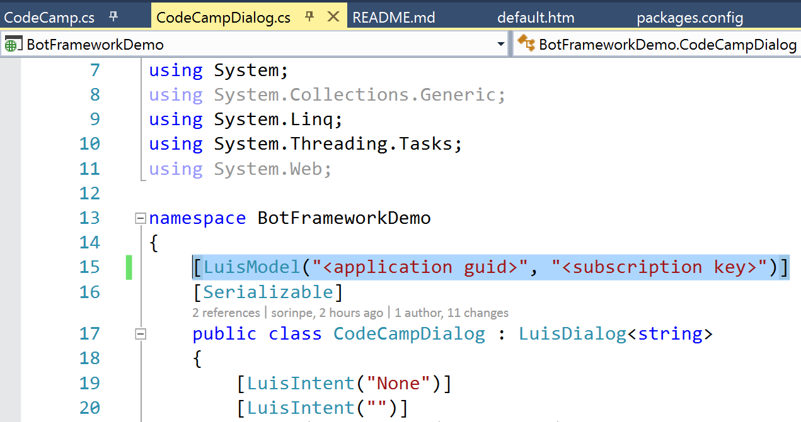
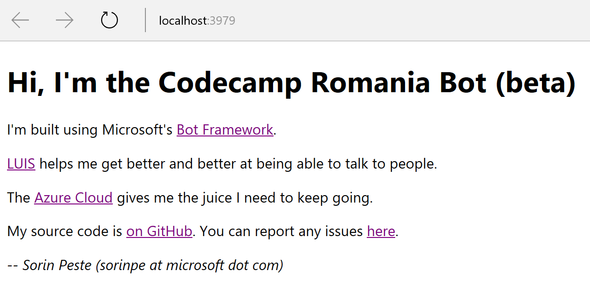
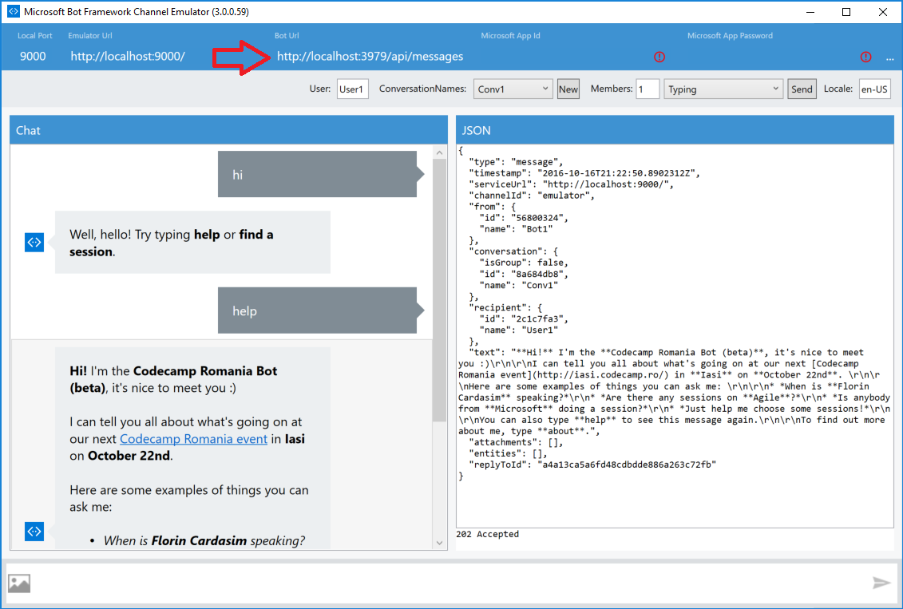
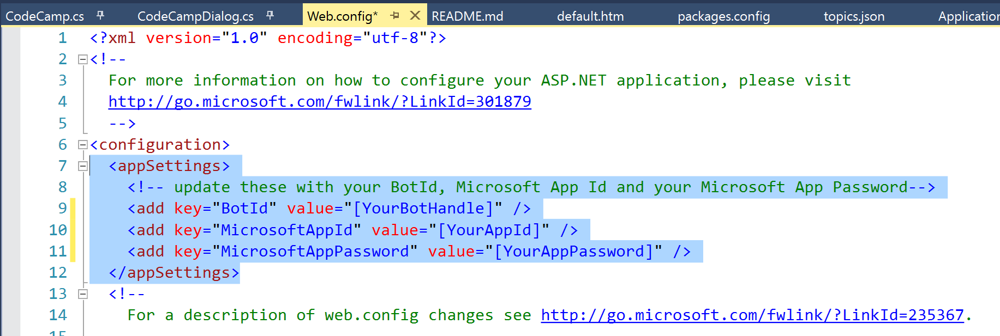

# Codecamp Romania Bot (beta)

A demo of using [Microsoft Bot Framework](https://dev.botframework.com/) and [Language Understanding Intelligent Service](http://luis.ai) (LUIS) to produce an intelligent bot.

This bot allows users to find sessions that of interest to them at [Codecamp Romania](http://www.codecamp.ro) events.

## Setup

Follow these steps to set up your own copy of this bot:

1. Clone this repository.

2. Log onto [LUIS.ai](http://luis.ai) and [import an application](https://www.luis.ai/Help/Index#ImportingApps) by using the `BotFrameworkDemo/CodeCampDemoLuisApp.json` file. 

3. [Train](https://www.luis.ai/Help/Index#Training) and [Publish](https://www.luis.ai/Help/Index#PublishingModel) your model.

4. Open the `BotFrameworkDemo.sln` solution file in Visual Studio 2015 or later.

5. Open the `BotFrameworkDemo/CodeCampDialog.cs` file and point the bot dialog at your imported LUIS model. 
   * You will find the **LUIS Application ID** in the URL of the application, when editing it inside the LUIS.ai portal. (the URL will be `https://www.luis.ai/application/xxxxxxx-xxxx-xxxx-xxxx-xxxxxxxxxxxx`)
   * You will find your **LUIS Subscription Key** in the [User Settings](https://www.luis.ai/Home/UserSettings) section of the same portal.

    

6. Build and run the `BotFrameworkDemo` project in Debug mode. You should have a web application running on `http://localhost:3979/`.

    

7. Use the [Bot Framework Channel Emulator](https://download.botframework.com/bf-v3/tools/emulator/publish.htm) to test the bot locally. The only configuration required is to set the Bot URL to `http://localhost:3979/api/messages`.

    

8. Go to [Microsoft Bot Framework](https://dev.botframework.com/) portal and [register a new bot](https://dev.botframework.com/bots/new), then you can enable it for Skype and any other channels you like.

9. To make your bot accessible by other users, you need to:
    * Update the `Web.config` file of the project to reflect the correct `BotId`, `MicrosoftAppId` and `MicrosoftAppPassword` for the bot you have registered.

        

    * Deploy the `BotFrameworkDemo` web application to a public website host - for example [Azure App Service](https://azure.microsoft.com/en-us/services/app-service/). Here is [a tutorial](https://azure.microsoft.com/en-us/documentation/articles/web-sites-dotnet-get-started/). You can get $25 of free Azure per month by signing up for [Visual Studio Dev Essentials](https://www.visualstudio.com/dev-essentials/).
    * Publish the bot from the [Microsoft Bot Framework](https://dev.botframework.com/) portal.

You can post any issues you find with this bot right inside the Issues section of this GitHub repo.

## Have fun!

*Sorin Peste (sorinpe at microsoft dot com)*